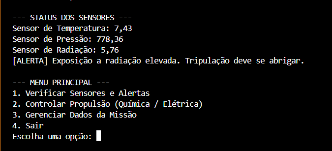
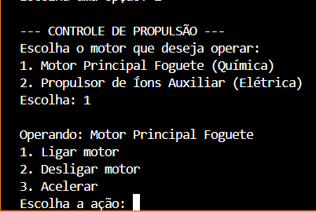
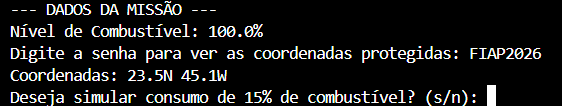

# Plataforma de Monitoramento de Sistemas Espaciais 🚀

**Global Solution 2026 - Programação Orientada a Objetos (POO)**

## 👨‍💻 Integrantes
* Giovanni de Lela Anjos Costa - RM: 563066
* Gabriel Nakamura - RM: 562221
* Gisleine Muñoz Ticona - RM: 563804

## 📖 Sobre o Projeto
Este projeto é um sistema de monitoramento espacial desenvolvido em Java puro. O objetivo da plataforma é simular o controle de uma estação espacial, gerenciando sensores, sistemas de propulsão e protegendo dados sensíveis da missão. O sistema roda via console com um menu interativo e aplica os cinco pilares principais da Programação Orientada a Objetos exigidos pelo edital.

## 🎯 Conceitos de POO Aplicados
* **Classe Abstrata:** Implementada em `ComponenteEspacial` para definir os atributos básicos e impor o método `realizarDiagnostico()`.
* **Interface:** O contrato `Sensor` padroniza os métodos obrigatórios para `SensorTemperatura`, `SensorPressao` e `SensorRadiacao`.
* **Encapsulamento:** A classe `DadosMissao` protege as coordenadas da nave com senha de acesso e impede o uso de valores negativos no tanque de combustível.
* **Herança & Polimorfismo:** A classe abstrata `SistemaPropulsao` atua como mãe para `PropulsaoQuimica` e `PropulsaoEletrica`, que sobrescrevem o método de aceleração com comportamentos e atributos físicos específicos.
* **Sistema de Alertas:** Lógica de detecção automática para níveis nominais, de atenção e críticos baseados na flutuação de dados.

## ⚙️ Como Executar
1. Clone este repositório em sua máquina.
2. Navegue até o diretório do projeto (`projeto-espacial`).
3. Compile todos os arquivos Java:
   `javac *.java`
4. Execute a classe principal:
   `java SistemaMonitoramento`

## 📸 Demonstração

